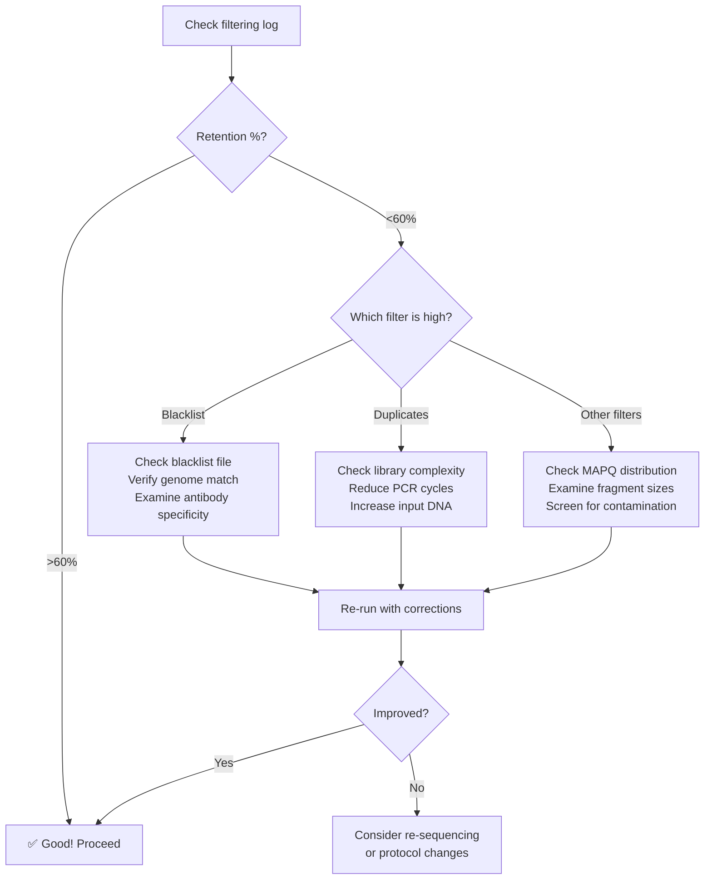

# How to Interpret Filtering Logs

## 🎯 Purpose

This guide helps you understand what the filtering statistics mean and how to use them to assess data quality and troubleshoot issues.

---

## 📊 Understanding the Numbers

### Example Log Output

```
Total reads (input):                      10,000,000

Reads overlapping blacklist regions:       1,500,000  (15.00%)
Duplicate reads (marked by Picard):        3,000,000  (30.00%)
Reads removed by other filters*:           1,575,000  (15.75%)

Total reads REMOVED (all filters):         6,075,000  (60.75%)
Total reads RETAINED:                      3,925,000  (39.25%)
```

---

## 🔍 What Each Metric Means

### 1. **Reads overlapping blacklist regions**
- **What it is**: Reads that align to genomic regions known to cause false positives
- **Source**: ENCODE blacklist (high signal regions, repeats, etc.)
- **Calculation**: `samtools view -c -L blacklist.bed input.bam`
- **Typical range**: 1-20% (depends on genome and blacklist file)

#### ⚠️ When to worry:
- **> 30%**: Very high - check if blacklist file is correct
- **< 1%**: Very low - might indicate blacklist wasn't applied correctly

#### 🔧 Action:
```bash
# Verify blacklist file
wc -l blacklist.bed

# Check which chromosomes are blacklisted
cut -f1 blacklist.bed | sort | uniq -c
```

---

### 2. **Duplicate reads (marked by Picard)**
- **What it is**: PCR or optical duplicates identified by Picard MarkDuplicates
- **Why they're bad**: Amplification bias, not representing unique DNA fragments
- **Calculation**: `samtools view -c -f 0x0400 input.bam`
- **Typical range**: 10-40% (depends on library complexity)

#### ⚠️ When to worry:
- **> 50%**: Very high duplication - low library complexity, possible over-amplification
- **> 70%**: Critical - library might be over-sequenced or poorly prepared

#### 🔧 Action:
```bash
# Check library complexity with Picard EstimateLibraryComplexity
# Or examine Picard metrics:
cat results/picard_metrics/*.metrics

# If duplication is high, consider:
# 1. Using more starting material
# 2. Reducing PCR cycles
# 3. Using UMIs (unique molecular identifiers)
```

---

### 3. **Reads removed by other filters**
These include multiple quality filters:
- **MAPQ < 1**: Multi-mapping reads (align to multiple locations)
- **Fragment size > 500bp**: Abnormally large fragments (default threshold)
- **Secondary alignments**: Alternative alignments (`-F 0x0100`)
- **Supplementary alignments**: Chimeric alignments (`-F 0x0800`)
- **Unmapped reads**: Reads that didn't align (`-F 0x004 -F 0x0008`)

**Typical range**: 5-20%

#### ⚠️ When to worry:
- **> 30%**: High - check data quality, alignment parameters
- **MAPQ issues**: May indicate repetitive regions or contamination
- **Fragment size issues**: May indicate DNA fragmentation problems

#### 🔧 Action:
```bash
# Check MAPQ distribution
samtools view input.bam | awk '{print $5}' | sort | uniq -c

# Check fragment size distribution
samtools view -f 0x0002 input.bam | \
  awk '{if($9>0) print $9}' | \
  sort -n | uniq -c > fragment_sizes.txt

# Plot distribution (requires R)
```

---

## 📈 Interpreting Total Filtering Impact

### Scenario 1: Healthy Sample (Good Quality)
```
Total reads (input):                      10,000,000

Reads overlapping blacklist regions:         500,000  (5.00%)
Duplicate reads (marked by Picard):         2,000,000  (20.00%)
Reads removed by other filters*:              800,000  (8.00%)

Total reads REMOVED (all filters):          3,300,000  (33.00%)
Total reads RETAINED:                       6,700,000  (67.00%)  ✅ GOOD!
```

**Interpretation**: 
- Low blacklist overlap (5%)
- Moderate duplication (20%)
- Low other filters (8%)
- **67% retention is excellent!**

---

### Scenario 2: High Duplication (Over-amplified)
```
Total reads (input):                      10,000,000

Reads overlapping blacklist regions:         800,000  (8.00%)
Duplicate reads (marked by Picard):         6,000,000  (60.00%)  ⚠️ HIGH!
Reads removed by other filters*:              700,000  (7.00%)

Total reads REMOVED (all filters):          7,500,000  (75.00%)
Total reads RETAINED:                       2,500,000  (25.00%)  ⚠️ LOW!
```

**Interpretation**:
- **60% duplicates is very high!**
- Library complexity is low
- Might need to re-sequence with less PCR or more input DNA

**Actions**:
1. Check Picard metrics for library complexity
2. Consider using deduplication tools (e.g., UMI-based)
3. Reduce PCR cycles in library prep
4. Increase starting DNA amount

---

### Scenario 3: High Blacklist Overlap (Problematic)
```
Total reads (input):                      10,000,000

Reads overlapping blacklist regions:       3,500,000  (35.00%)  ⚠️ VERY HIGH!
Duplicate reads (marked by Picard):         2,500,000  (25.00%)
Reads removed by other filters*:              500,000  (5.00%)

Total reads REMOVED (all filters):          6,500,000  (65.00%)
Total reads RETAINED:                       3,500,000  (35.00%)
```

**Interpretation**:
- **35% blacklist overlap is extremely high!**
- May indicate:
  - Wrong blacklist file (e.g., using mm10 blacklist with hg38 data)
  - Antibody targeting repetitive regions
  - Non-specific binding

**Actions**:
1. Verify blacklist file matches genome assembly
2. Check antibody quality and specificity
3. Examine alignment summary (e.g., FastQC, MultiQC)
4. Consider different antibody or experimental protocol

---

### Scenario 4: High "Other Filters" (Quality Issues)
```
Total reads (input):                      10,000,000

Reads overlapping blacklist regions:         700,000  (7.00%)
Duplicate reads (marked by Picard):         2,000,000  (20.00%)
Reads removed by other filters*:            4,000,000  (40.00%)  ⚠️ VERY HIGH!

Total reads REMOVED (all filters):          6,700,000  (67.00%)
Total reads RETAINED:                       3,300,000  (33.00%)
```

**Interpretation**:
- **40% removed by other filters is very high!**
- Likely issues:
  - Many multi-mappers (repetitive sequences)
  - Poor sequencing quality
  - Contamination
  - Abnormal fragment sizes

**Actions**:
```bash
# 1. Check MAPQ distribution (multi-mapping)
samtools view input.bam | awk '{print $5}' | sort -n | uniq -c

# 2. Check fragment size distribution
samtools view -f 0x0002 input.bam | awk '{if($9>0) print $9}' | head -1000

# 3. Check for contamination
fastq_screen --aligner bowtie2 *.fastq.gz

# 4. Re-examine alignment parameters
# Consider adjusting:
# - MAPQ threshold (currently -q 1)
# - Fragment size threshold (currently 500bp)
```

---

## 📋 Quick Reference Table

| Metric | Excellent | Good | Acceptable | Concerning | Action Needed |
|--------|-----------|------|------------|------------|---------------|
| **Retention %** | >70% | 60-70% | 50-60% | 40-50% | <40% |
| **Blacklist %** | <5% | 5-10% | 10-20% | 20-30% | >30% |
| **Duplicates %** | <20% | 20-30% | 30-40% | 40-50% | >50% |
| **Other filters %** | <10% | 10-15% | 15-25% | 25-35% | >35% |

---

## 🔬 Biological Context

### ChIP-seq Expected Ranges:
- **Good ChIP-seq**: 50-70% retention
- **Excellent ChIP-seq**: >70% retention
- **Problematic ChIP-seq**: <40% retention

### Common Issues by Read Type:

**High blacklist overlap**:
- Histone marks (H3K4me3, H3K27me3) near centromeres/telomeres
- Transcription factors binding to repetitive elements

**High duplication**:
- Low input DNA
- Excessive PCR amplification
- Over-sequencing (more reads than unique fragments)

**High multi-mapping**:
- Antibody targeting repetitive regions
- Genome with many paralogs
- Contamination with other species

---

## 🛠️ Troubleshooting Workflow



---

## 📚 Additional Resources

### Commands to Generate Detailed Reports:

```bash
# 1. Comprehensive BAM statistics
samtools flagstat input.bam > flagstat.txt
samtools stats input.bam > stats.txt

# 2. MAPQ distribution
samtools view input.bam | awk '{print $5}' | \
  sort -n | uniq -c | sort -rn > mapq_distribution.txt

# 3. Fragment size distribution
samtools view -f 0x0002 input.bam | \
  awk '{if($9>0) print $9}' | \
  sort -n | uniq -c > fragment_sizes.txt

# 4. Duplication metrics (from Picard)
cat results/picard_metrics/*.metrics

# 5. MultiQC summary (if available)
multiqc results/ -o multiqc_report/
```

---

## 🎓 Learning More

- **ENCODE Guidelines**: https://www.encodeproject.org/chip-seq/
- **Picard Metrics**: https://broadinstitute.github.io/picard/
- **SAMtools Documentation**: http://www.htslib.org/doc/samtools.html
- **nf-core/chipseq Documentation**: https://nf-co.re/chipseq

---

## ✨ Key Takeaways

1. **Context matters**: Expected ranges vary by experiment type
2. **No single metric**: Look at the overall picture
3. **Categories overlap**: A read can be both duplicate AND in blacklist
4. **Document everything**: Keep notes on unusual findings
5. **When in doubt**: Compare to similar experiments or published datasets

---

**Remember**: These filters exist to improve data quality. A high removal rate isn't always bad - it means the pipeline is doing its job! Focus on whether the **retained reads** are sufficient for your biological question.
